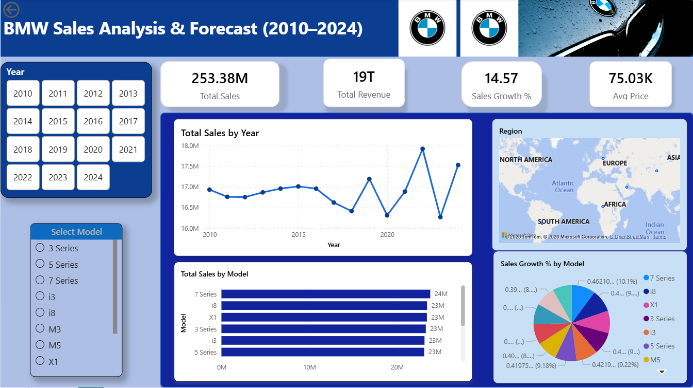

# 🚗 BMW Sales & Price Analysis Dashboard (2010–2024)

This project presents an interactive Power BI dashboard analyzing BMW car sales and pricing trends from 2010 to 2024.

---

## 📊 Project Overview

The dashboard provides insights into:

- Sales trends over time  
- Model-wise and regional performance  
- Price analysis (Average, Maximum, Minimum)  
- Relationship between price and sales  

---

## 🛠️ Tools & Technologies

- Microsoft Power BI  
- Data Cleaning & Transformation  
- DAX (Data Analysis Expressions)  
- Data Visualization  

---

## 📈 Key Insights

- Mid-range BMW models show the highest sales volume  
- Premium models have higher prices but lower sales  
- Sales trends indicate fluctuations with overall growth  
- Price variations impact sales performance  

---

## 📸 Dashboard Preview

---

## 📁 Dataset

The dataset includes:

- Year  
- Model  
- Category  
- Region  
- Sales Volume  
- Price  

---

## 💡 Conclusion

This project demonstrates how data visualization can be used to extract meaningful business insights and support decision-making.

---

## 🔗 Connect with Me

Feel free to connect with me on LinkedIn and share your feedback!
